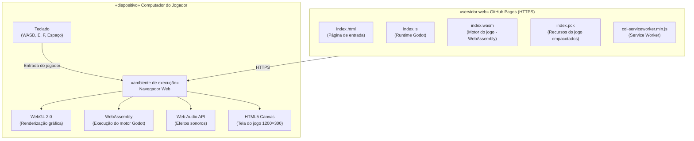
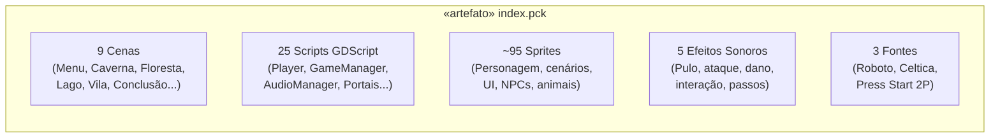

# Diagrama de Implantação — Homem Primitivo

> **Projeto:** Homem Primitivo - Projeto de Extensão  
> **Engine:** Godot 4.7  
> **Hospedagem:** GitHub Pages  

---

## Diagrama de Implantação

---

## Conteúdo do Pacote de Recursos (index.pck)

